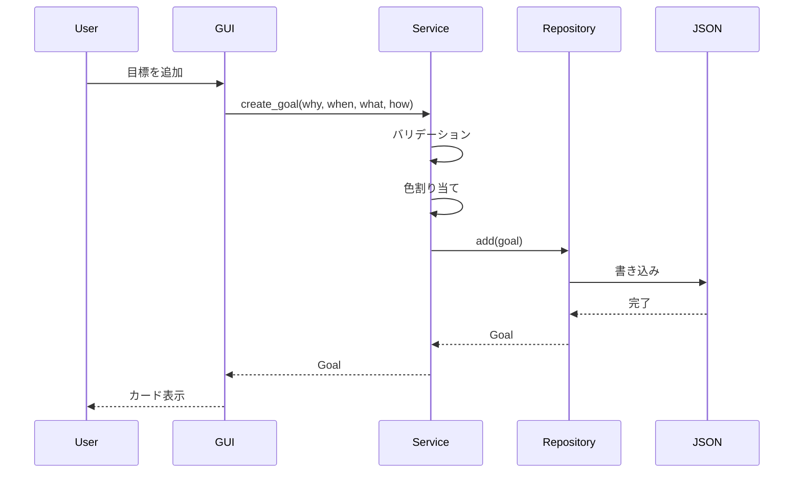

# システムアーキテクチャ設計書

更新日: 2026-02-27

## 概要

Study Qualification Applicationは、社会人の自己学習者向けPySide6 GUIアプリケーションである。
複数の学習目標を3W1H（Why・When・What・How）で登録し、ガントチャートで進捗を視覚的に管理する。
タスクごとの学習時間を手動入力・タイマー計測で記録し、統計ページで集計結果を確認できる。
習慣化の後押し（ストリーク・今日の学習状況）と小さな達成感（実績）で自己研鑽の継続を支援する。
過去の自分と今の自分を比較する「自己比較」機能（自己ベスト記録・学習継続率）により、実績の積み上がりを実感できる。
学習アクティビティチャートでは年別/月別/週別/日別をプルダウンで動的に切替え、期間ごとの学習時間推移を可視化できる。
カスタマイズ可能なダッシュボード（アプリ起動時のデフォルトページ）でユーザーが重要な情報を自由に配置・並べ替えできる。
書籍を登録し、タスクと紐付けて読書管理を行い、読了時に要約・感想を蓄積してダッシュボードの本棚ウィジェットで可視化できる。

## ペルソナ

**田中太郎（32歳・ITエンジニア）**: 仕事をしながらAWS資格とTOEICの勉強を並行。帰宅後の限られた時間で計画的に学習したい。「なぜやるのか」を見返してモチベーションを維持し、ガントチャートで進捗を把握したい。

## レイヤードアーキテクチャ

```
┌─────────────────────────────────────────┐
│           GUI Layer (View)              │
│  - PySide6ウィジェット                  │
│  - イベントハンドラ                      │
│  - 表示更新                              │
└──────────────────┬──────────────────────┘
                   │ 呼び出し
┌──────────────────▼──────────────────────┐
│         Service Layer (Logic)            │
│  - ビジネスロジック                      │
│  - バリデーション                        │
│  - ユニットテスト対象                    │
└──────────────────┬──────────────────────┘
                   │ 呼び出し
┌──────────────────▼──────────────────────┐
│        Repository Layer (Data)           │
│  - JSON永続化                            │
│  - CRUD操作                              │
└─────────────────────────────────────────┘
```

## データモデル

### Goal（3W1H目標）

| フィールド | 型 | 説明 |
|-----------|-----|------|
| id | str (UUID) | 一意識別子 |
| why | str | 学習の動機・目的 |
| when_target | str | 目標日 or 期間文字列 |
| when_type | WhenType | "date" or "period" |
| what | str | 学習対象 |
| how | str | 学習方法 |
| created_at | str (ISO8601) | 作成日時 |
| updated_at | str (ISO8601) | 更新日時 |
| color | str (HEX) | 表示色（自動割り当て） |

### Task（ガントチャートタスク）

| フィールド | 型 | 説明 |
|-----------|-----|------|
| id | str (UUID) | 一意識別子 |
| goal_id | str (UUID) | 親Goalへの参照（書籍タスクは"__books__"） |
| title | str | タスク名 |
| start_date | date | 開始日 |
| end_date | date | 終了日 |
| status | TaskStatus | "not_started" / "in_progress" / "completed" |
| progress | int (0-100) | 進捗率 |
| memo | str | メモ |
| book_id | str | 関連書籍ID（空文字で未設定） |
| order | int | 表示順 |
| created_at | str (ISO8601) | 作成日時 |
| updated_at | str (ISO8601) | 更新日時 |

### Book（書籍）

| フィールド | 型 | 説明 |
|-----------|-----|------|
| id | str (UUID) | 一意識別子 |
| title | str | 書籍名 |
| status | BookStatus | "unread" / "reading" / "completed" |
| summary | str | 要約（読了時に記入） |
| impressions | str | 感想（読了時に記入） |
| completed_date | date \| None | 読了日 |
| created_at | str (ISO8601) | 作成日時 |
| updated_at | str (ISO8601) | 更新日時 |

### StudyLog（学習ログ）

| フィールド | 型 | 説明 |
|-----------|-----|------|
| id | str (UUID) | 一意識別子 |
| task_id | str (UUID) | 親Taskへの参照 |
| study_date | date | 学習実施日 |
| duration_minutes | int (>0) | 学習時間（分） |
| memo | str | メモ |
| created_at | str (ISO8601) | 作成日時 |

## クラス構成

### Models

- `Goal` (dataclass): 3W1H目標データ。`to_dict()`/`from_dict()` でJSON変換。
- `Task` (dataclass): タスクデータ。バリデーション付き（progress範囲、日付順序）。`BOOK_GANTT_GOAL_ID`定数で書籍タスクを識別。
- `StudyLog` (dataclass): 学習ログデータ。バリデーション付き（duration_minutes > 0）。
- `Book` (dataclass): 書籍データ。読了レビュー（summary, impressions）を含む。
- `WhenType` (Enum): DATE / PERIOD
- `TaskStatus` (Enum): NOT_STARTED / IN_PROGRESS / COMPLETED
- `BookStatus` (Enum): UNREAD / READING / COMPLETED

### Repositories

- `JsonStorage`: 汎用JSON読み書き。Pathベースでファイル操作。
- `GoalRepository`: Goal CRUD。JsonStorageを利用。
- `TaskRepository`: Task CRUD。goal_id・book_idでフィルタ可能。
- `StudyLogRepository`: StudyLog CRUD。task_idでフィルタ可能。複数task_id一括取得対応。
- `BookRepository`: Book CRUD。JsonStorageを利用。

### Services

- `GoalService`: Goal作成（バリデーション、色自動割り当て）、更新、削除（タスク連鎖削除）。
- `TaskService`: Task CRUD、ステータス自動管理（進捗率に連動）。
- `StudyLogService`: 学習ログCRUD、タスク/目標単位の統計集計（TaskStudyStats, GoalStudyStats）。
- `GanttCalculator`: 日付→ピクセル変換、タイムライン範囲計算、バー座標計算。
- `StudyStatsCalculator`: 学習ログの集計。日別（DailyStudyData, DailyActivityData）と期間別（ActivityChartData: 年別/月別/週別/日別）の棒グラフ描画用データ生成。
- `MotivationCalculator`: モチベーション関連の統計計算（ストリーク、今日の学習、実績、自己ベスト記録、学習継続率）。
- `BookService`: 書籍CRUD、読了記録、タスクbook_idクリア連鎖（書籍タスクは完全削除、参照タスクはbook_idクリア）。BookshelfDataでダッシュボード用集計。
- `BookGanttService`: 書籍ガントチャート管理。書籍タスク取得、書籍進捗の自動同期（タスク進捗平均→書籍progress/status）。
- `DashboardLayoutService`: ダッシュボードのレイアウト設定管理。ウィジェット登録簿（9種類）、配置の永続化・並べ替え・追加・削除・リサイズ。
- `HolidayService`: 日本の祝日判定（jpholidayラッパー）。年単位キャッシュ付き。

### GUI

- `MainWindow`: QMainWindow。サイドバー + QStackedWidget（5ページ）。
- `Sidebar`: アイコン付きナビゲーション（ダッシュボード/目標/ガントチャート/書籍/統計）。テーマ切替ボタン。
- `DashboardPage`: カスタマイズ可能なダッシュボード。ヘッダーに🏆実績ボタン配置。2カラムグリッドでウィジェットを配置。編集モードでドラッグ&ドロップ並べ替え、追加・削除・リサイズ。
- `DashboardWidgetFrame`: ダッシュボードウィジェットのラッパー。編集モード時にヘッダーバー（ドラッグハンドル、リサイズ、削除）を表示。DRAG_MIME_TYPEでインデックスベースのドラッグを実行。
- `DashboardGridContainer`: ドラッグ&ドロップを受け付けるグリッドコンテナ。DRAG_MIME_TYPE（並べ替え）とPALETTE_DRAG_MIME_TYPE（パレットから追加）の両方を処理。
- `WidgetPalettePanel`: 編集モード時にスクロールエリア右側に表示されるパレットパネル。未配置ウィジェットをPaletteItemとして一覧表示。update_items()で動的にアイテムを更新。
- `PaletteItem`: パレット内の個別ウィジェットカード。ドラッグ操作でPALETTE_DRAG_MIME_TYPEを使用し、ウィジェットタイプ文字列をグリッドにドロップして追加。
- `GoalPage`: 目標カード一覧。追加/編集/削除。
- `GoalCard`: 目標情報をカード形式で表示。
- `GanttPage`: 統合セレクタコンボ（すべてのタスク・各目標・すべての書籍・各書籍を常時表示）+ ガントチャート + タイマー + 学習記録ボタン。セレクタでチャート表示を切替。タスク追加時に目標/読書の選択ダイアログを表示。
- `GanttChart`: QGraphicsView/Scene。バー描画、今日線、月/日ヘッダー。
- `GanttBarItem`: QGraphicsRectItem。計画バー + 進捗オーバーレイ。
- `BookPage`: 書籍管理ページ。書籍の登録・ステータス変更・読了記録・削除を行う独立ページ。
- `StatsPage`: 学習統計ページ。ヘッダー（右に🏆実績ボタン） + 今日バナー + サマリーカード + 自己ベスト記録 + 継続率 + 学習アクティビティチャート（期間切替） + 目標別統計セクション（プルダウン切替） + ログ履歴テーブル。
- `SummaryCard`: アイコン + 値 + ラベルのサマリー表示。
- `GoalStatsSection`: プルダウン付き目標別統計セクション。「目標」「読書」を切替え、GoalStatsCardを動的に再構築。GoalStatsDisplayDataで表示データを受け取る。
- `GoalStatsCard`: 目標別の学習統計（タスク内訳付き）。GoalStatsSection内で生成。
- `TodayStudyBanner`: 今日の学習状況バナー。学習済み（success色）/未学習（warning色）を表示。
- `PersonalRecordCard`: 自己ベスト記録カード。1日最長・週間最長・最長連続・累計を表示。
- `ConsistencyCard`: 学習継続率カード。今週・今月・全体の継続率を色分け表示（80%以上=success, 50-80%=warning, 50%未満=error）。
- `MilestoneButton`: 🏆アイコンボタン（QPushButton）。set_data(MilestoneData)でデータを保持し、クリックでMilestonePopupを表示。StatsPage・DashboardPageのヘッダーに配置。
- `MilestonePopup`: 実績ポップアップダイアログ（QDialog）。上部に累計値（累計学習時間・累計学習日数・連続学習日数）、下部に閾値達成通知と次の目標を表示。
- `ActivityChartSection`: 期間切替プルダウン（日別/週別/月別/年別） + DailyActivityChartの複合ウィジェット。全期間データを一括保持し、プルダウン変更で即座にチャート切替。
- `DailyActivityChart`: 学習時間の棒グラフ（QPainter描画）。DailyActivityData（後方互換）とActivityChartData（期間別）の両データ型に対応。
- `StudyLogTable`: 学習ログ履歴テーブル（QTableWidget）。日付・タスク名・時間・メモを表示。
- `GoalDialog`: 目標登録/編集フォーム。日本祝日対応カレンダー付き。
- `TaskDialog`: タスク登録/編集フォーム。日本祝日対応カレンダー付き。関連書籍選択コンボ付き。書籍タスクモード（book_task_mode）で必須書籍セレクタ表示。
- `BookManagementDialog`: 書籍管理ダイアログ。書籍の登録・ステータス変更・読了記録・削除。BookServiceを直接受取。
- `BookReviewDialog`: 読了レビューダイアログ。要約・感想・読了日を入力。
- `StudyLogDialog`: 学習時間手動入力ダイアログ。タスク選択 + 日付 + 時間 + メモ。
- `StudyTimerWidget`: リアルタイム学習計測タイマー。停止時に自動記録。
- `JapaneseCalendarWidget`: QCalendarWidget拡張。土曜青・日曜赤・祝日赤の色分け表示。
- `CalendarDialog`: カレンダー日付選択ダイアログ。
- `CalendarDatePicker`: 日付表示 + カレンダーボタンの日付選択ウィジェット。
- `BookshelfWidget`: 本棚ダッシュボードウィジェット。登録書籍数・読了数・最近の読了を表示。
- `ThemeManager`: ダーク/ライト切替。QSS生成。設定永続化。

## ガントチャート描画方式

`QGraphicsView` + `QGraphicsScene` を使用:

- **ヘッダー**: 月の目盛りを上部に描画
- **グリッド**: 縦線で月境界を表示
- **バー**: 各タスクをQGraphicsRectItemで描画
  - 計画バー（半透明）の上に実績バー（進捗%分の幅）を重ねる
  - 目標の色で統一表示
- **今日線**: 赤い破線で現在日を表示
- **ツールチップ**: バーホバーでタスク詳細を表示

### 座標計算（GanttCalculator）

- `pixels_per_day = 30`: 1日あたりのピクセル数
- `row_height = 40`: 1行の高さ
- `header_height = 70`: ヘッダー高さ（2段構成：月ラベル + 日ラベル）
- `bar_height = 24`: バーの高さ
- `bar_margin = 8`: バーの上下マージン

## テーマシステム

QSSテンプレートに色パレットを展開する方式。

### カラーパレット

**ダークテーマ（Catppuccin Mocha）:**
- 背景: #1E1E2E
- テキスト: #CDD6F4
- アクセント: #89B4FA

**ライトテーマ（Catppuccin Latte）:**
- 背景: #EFF1F5
- テキスト: #4C4F69
- アクセント: #1E66F5

### テーマ永続化

`data/settings.json` に `{"theme": "dark"}` 形式で保存。

## データフロー



## 日本祝日対応カレンダー

日付選択のQDateEditにカスタムQCalendarWidgetを適用し、日本の暦を反映した色分け表示を行う。

### 色分けルール

| 日付種別 | 色 | 優先度 |
|---------|-----|--------|
| 祝日 | 赤 (#DC2626) | 最高（土曜より優先） |
| 日曜日 | 赤 (#DC2626) | 高 |
| 土曜日 | 青 (#2563EB) | 中 |
| 平日 | 黒 (#1F2937) | 低 |

### 構成

- `HolidayService`: jpholidayライブラリを使用して祝日判定。年単位でキャッシュし、paintCellの高頻度呼び出しに対応。
- `JapaneseCalendarWidget`: QCalendarWidgetのpaintCellをオーバーライドし、HolidayServiceで取得した情報に基づき色分け描画。
- `create_japanese_date_edit()`: ファクトリ関数。GoalDialog・TaskDialogの両方で使用。

### 適用箇所

- GoalDialog: When（いつまでに）の日付入力
- TaskDialog: 開始日・終了日の日付入力

## 学習時間トラッキング

タスクごとの学習時間を記録・集計し、統計ページで確認できる。忙しい社会人のモチベーション維持を目的とする。

### 記録方法

- **手動入力**: StudyLogDialogで日付・時間・タスクを選択して記録
- **タイマー計測**: StudyTimerWidgetでリアルタイム計測。停止時に自動記録（最小1分、切り上げ）

### 統計ページ（StatsPage）

- **今日の学習状況バナー**: 学習済み/未学習を大きく表示（TodayStudyBanner）
- **サマリーカード**: 合計学習時間、学習日数（ユニーク日数）、目標数、連続学習日数（ストリーク）
- **自己ベスト記録カード**: 1日最長・週間最長・最長連続・累計時間/日数を表示（PersonalRecordCard）
- **継続率カード**: 今週・今月・全体の学習継続率を色分け表示（ConsistencyCard）
- **実績ボタン**: ヘッダー右に🏆アイコンボタンを配置。クリックでポップアップダイアログに実績を表示（MilestoneButton + MilestonePopup）
- **学習アクティビティチャート**: 年別/月別/週別/日別をプルダウンで切替え、期間ごとの学習時間を棒グラフで表示（ActivityChartSection）
- **目標別統計セクション**: プルダウンで「目標」「読書」を切替え、選択に応じた統計カードを動的表示（GoalStatsSection）
- **学習ログ履歴テーブル**: 個別の学習ログを日付降順でテーブル表示（StudyLogTable）※最下部に配置

### 集計用データクラス

- `TaskStudyStats`: タスク単位の統計（total_minutes, study_days, log_count）
- `GoalStudyStats`: 目標単位の統計（task_stats[], total_minutes, total_study_days）
- `DailyStudyData`: 1日分の集計データ（study_date, total_minutes）
- `DailyActivityData`: チャート描画用データ（days[], max_minutes, period_start, period_end）
- `StreakData`: 連続学習日数データ（current_streak, longest_streak, studied_today）
- `TodayStudyData`: 今日の学習状況データ（total_minutes, session_count, studied）
- `MilestoneData`: 実績データ（total_hours, study_days, current_streak, achieved[], next_milestone）
- `ActivityPeriodType`: 集計期間種別Enum（YEARLY, MONTHLY, WEEKLY, DAILY）
- `ActivityBucketData`: 期間バケットデータ（label, total_minutes, period_start, period_end）
- `ActivityChartData`: 期間別チャートデータ（period_type, buckets[], max_minutes）
- `PersonalRecordData`: 自己ベスト記録データ（best_day_minutes, best_day_date, best_week_minutes, best_week_start, longest_streak, total_hours, total_study_days）
- `ConsistencyData`: 学習継続率データ（this_week_days, this_week_total, this_month_days, this_month_total, overall_rate, overall_study_days, overall_total_days）
- `BookshelfData`: 本棚ダッシュボード用データ（total_count, completed_count, reading_count, recent_completed[]）
- `GoalStatsDisplayData`: 目標別統計の表示データ（name, color, stats: GoalStudyStats, task_names）
- `DashboardWidgetConfig`: ダッシュボードウィジェットの配置設定（widget_type, column_span）
- `WidgetMetadata`: ウィジェットのメタデータ（widget_type, display_name, icon, default_span, allowed_spans）

### 学習アクティビティチャート描画方式

QWidgetの`paintEvent`でQPainterを使用した静的バーチャート描画:

- **バー**: 各バケットのaccentカラー角丸バー。高さはmax_minutesに対する比率
- **Y軸**: 分数ラベル（0, 中間値, 最大値）、基準ドット線
- **X軸**: バケット数に応じた間隔でラベル表示（15本以下は全表示、それ以上は7間隔）
- **0分のバケット**: border色の1px線で存在を表示
- テーマ対応: ThemeManager.get_colors()で色を動的取得

#### 期間切替（ActivityChartSection）

QComboBoxで以下の4期間を切替可能:

| 期間 | バケット数 | ラベル形式 | 範囲 |
|------|-----------|-----------|------|
| 日別 | 30 | "M/D" | 直近30日 |
| 週別 | 12 | "M/D~" | 直近12週（月曜起点） |
| 月別 | 12 | "N月" | 直近12ヶ月 |
| 年別 | 可変 | "YYYY" | 初ログ年〜今年 |

refresh時に4期間すべてを一括計算・保持し、プルダウン変更時は再計算なしで即座に切替。

## モチベーション機能

習慣化の後押しと小さな達成感で自己研鑽の継続を支援する。

### 習慣化の後押し

- **連続学習日数（ストリーク）**: Duolingo風の連続日数表示。今日未学習でも昨日まで連続していればストリーク維持。SummaryCardの4番目として表示。
- **今日の学習状況バナー**: ページ上部に学習済み（success色）/未学習（warning色）を大きく表示。学習時間・セッション数も表示。

### 小さな達成感

- **実績**: 累計値（累計学習時間・累計学習日数・連続学習日数）と閾値達成通知を表示。閾値は累計時間（1h,5h,10h...）、学習日数（3,7,14,30...日）、ストリーク（3,7,14,30...日）。

### 自己比較（過去の自分との比較）

- **学習アクティビティチャート**: 年別/月別/週別/日別の学習時間推移を棒グラフで表示。プルダウンで期間を動的に切替え可能。
- **自己ベスト記録**: 1日最長学習時間（日付付き）、週間最長学習時間（週の開始日付き）、最長連続学習日数、累計学習時間・日数を表示。success色でレコード値を強調。
- **学習継続率**: 今週・今月・全体の学習継続率を表示。80%以上=success色、50-80%=warning色、50%未満=error色で色分け。

### MotivationCalculator

Qt非依存の純粋ロジッククラス。5つの計算メソッドを提供:
- `calculate_streak()`: 学習日のセットから連続日数と最長ストリークを計算
- `calculate_today_study()`: 今日のログを集計（合計時間・セッション数）
- `calculate_milestones()`: 累計値と閾値達成通知を計算
- `calculate_personal_records()`: 日別・週別最高記録、最長連続、累計の算出
- `calculate_consistency()`: 今週・今月・全期間の学習継続率を算出

## ダッシュボード機能

アプリ起動時のデフォルトページ。ユーザーが自由にウィジェットを配置・カスタマイズできる。

### レイアウトシステム

- **2カラムグリッド**: ウィジェットは半幅（span=1）または全幅（span=2）で配置
- **ドラッグ&ドロップ**: 編集モードでウィジェットの順序を変更可能
- **設定永続化**: `settings.json`の`dashboard_layout`キーに保存（ThemeManagerと同じファイル）

### 利用可能ウィジェット（9種類）

| ウィジェット | タイプID | デフォルト幅 | リサイズ |
|-------------|---------|-------------|---------|
| 今日の学習状況 | today_banner | 全幅 | 可（半幅↔全幅） |
| 合計学習時間 | total_time_card | 半幅 | 可（半幅↔全幅） |
| 学習日数 | study_days_card | 半幅 | 可（半幅↔全幅） |
| 目標数 | goal_count_card | 半幅 | 可（半幅↔全幅） |
| 連続学習 | streak_card | 半幅 | 可（半幅↔全幅） |
| 自己ベスト | personal_record | 半幅 | 可（半幅↔全幅） |
| 学習の継続率 | consistency | 半幅 | 可（半幅↔全幅） |
| 本棚 | bookshelf | 全幅 | 可（半幅↔全幅） |
| 学習アクティビティ | daily_chart | 全幅 | 可（半幅↔全幅） |

※ 実績はダッシュボードヘッダーの🏆ボタン（MilestoneButton）に移行。クリックでポップアップ表示。

### 編集モード

「✏️ 編集」ボタンで編集モードに切り替え:
- 全ウィジェットにヘッダーバー（ドラッグハンドル ☰、ウィジェット名、リサイズ ↔、削除 ✕）を表示
- スクロールエリア右側にウィジェットパレットパネル（WidgetPalettePanel）を表示。未配置ウィジェットをカード形式で一覧表示し、ドラッグ&ドロップでグリッドの任意の位置に追加
- ウィジェット削除時にパレットが自動更新され、削除されたウィジェットが再びパレットに表示
- 「✓ 完了」ボタンで編集モードを終了し、レイアウトを保存

### DashboardLayoutService

Qt非依存の純粋ロジッククラス。`WIDGET_REGISTRY`（ClassVar）に全ウィジェットのメタデータを保持:
- `get_layout()`: 保存済みレイアウト取得（未保存時はデフォルト）
- `save_layout()`: settings.jsonに保存
- `get_available_widgets()`: 未配置ウィジェット一覧
- `reorder()` / `add_widget()` / `remove_widget()` / `resize_widget()`: レイアウト操作（イミュータブル、コピーを返す）

## 書籍管理機能

学習に関連する書籍を登録し、読書の進捗と感想を蓄積する。

### 概要

- **書籍登録**: 書籍名を入力して登録。ステータスは未読→読書中→読了と遷移
- **書籍タスク管理**: ガントチャートの読書タブで書籍ごとにタスクを作成・進捗管理。書籍タスクは`goal_id = BOOK_GANTT_GOAL_ID ("__books__")`で識別
- **進捗自動同期**: 書籍に紐づくタスクの進捗率平均→書籍progress。進捗からstatus自動決定（0%→未読, 1-99%→読書中, 100%→読了）
- **タスク紐付け**: タスクダイアログで関連書籍を選択可能
- **読了レビュー**: 読了時にBookReviewDialogで要約・感想・読了日を入力
- **ダッシュボード表示**: BookshelfWidgetで登録数・読了数・最近の読了書籍を表示

### データ設計

Bookモデルにレビュー情報（summary, impressions）を含む1モデルアプローチを採用。
各書籍に読了記録は1つのため、別モデルへの分離は不要。
書籍タスクは通常のTaskモデルを使用し、`goal_id = "__books__"`と`book_id = 書籍ID`で紐付け。

### BookService

- `create_book()`: 書籍登録
- `update_status()`: ステータス変更
- `complete_book()`: 読了記録（ステータスCOMPLETED + summary + impressions + completed_date）
- `delete_book()`: 削除時、書籍タスク（goal_id=="__books__"）は完全削除、参照タスクはbook_idクリア
- `get_bookshelf_data()`: ダッシュボード用集計データ（最近読了5件、各種カウント）

### BookGanttService

- `get_all_book_tasks()`: 全書籍タスク取得（goal_id == BOOK_GANTT_GOAL_ID）
- `sync_book_progress()`: タスク進捗平均→書籍progress/status/日付を同期
- `books_to_tasks()`: Book→仮想Task変換（後方互換）

### 画面構成

- **GanttPage**: 統合セレクタで「すべてのタスク」（目標+書籍）、「すべての書籍」、個別目標、個別書籍を選択。「+ タスク追加」クリック時に目標/読書の選択ダイアログを表示
- **BookPage**: サイドバーの「📚 書籍」タブから独立ページとしてアクセス。書籍の追加・ステータス変更・読了レビュー・削除を管理
- **TaskDialog**: 通常モードで関連書籍選択コンボボックス（なし + 登録書籍一覧）。書籍タスクモード（book_task_mode=True）で必須書籍セレクタ表示
- **DashboardPage**: BookshelfWidgetで本棚情報を表示

## 将来の拡張

サイドバーナビゲーション構造により、以下の機能を容易に追加可能:

- エクスポート/インポート機能
- 通知・リマインダー
- ダッシュボードウィジェットの追加（目標サマリー、学習カレンダー等）
