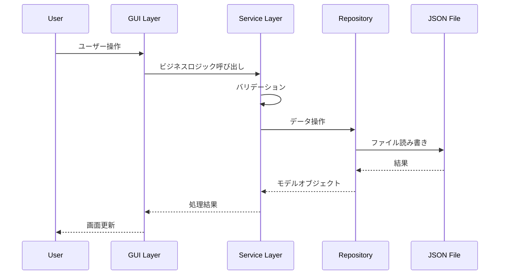
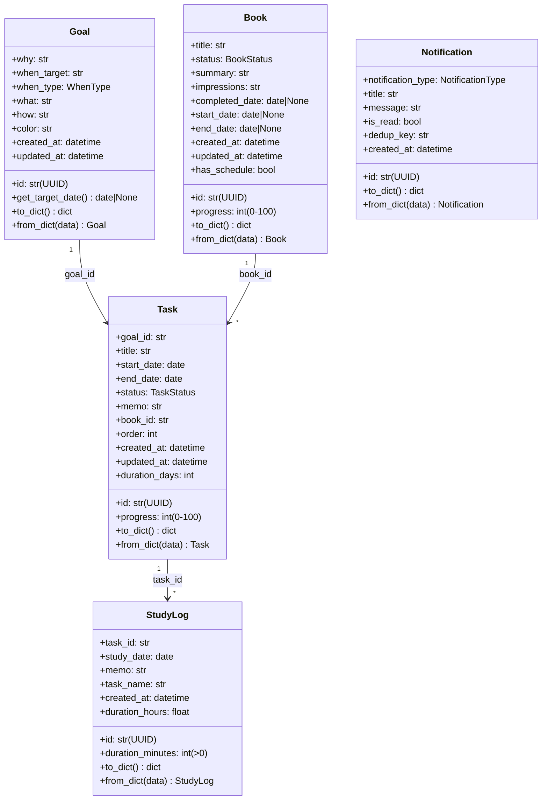
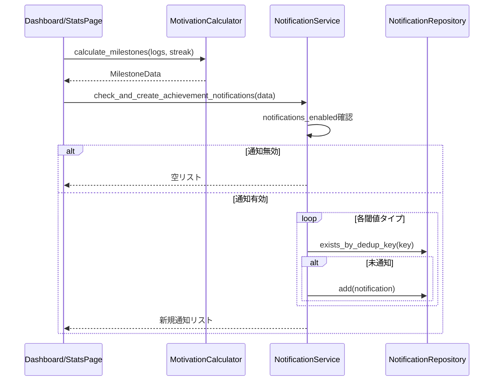
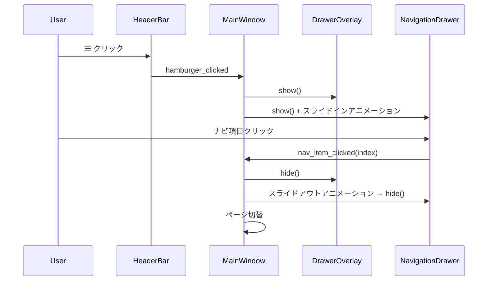

# システムアーキテクチャ設計書

更新日: 2026-03-03

## 変更履歴

| 日付 | 内容 |
|------|------|
| 2026-02-27 | 初版作成 |
| 2026-03-03 | 全面改訂（MECE対応・通知設定・データ管理・ハンバーガーメニュー追加反映） |

---

## 1. 概要

### 1.1 プロジェクト概要

Study Planner（Study Qualification Application）は、社会人の自己学習者向けPySide6デスクトップアプリケーションである。

**コアコンセプト**: 「なぜやるのか」を見返してモチベーションを維持し、計画的に学習を進める。

### 1.2 ペルソナ

**田中太郎（32歳・ITエンジニア）**: 仕事をしながらAWS資格とTOEICの勉強を並行。帰宅後の限られた時間で計画的に学習したい。「なぜやるのか」を見返してモチベーションを維持し、ガントチャートで進捗を把握したい。

### 1.3 主要機能一覧

| # | 機能 | 概要 |
|---|------|------|
| 1 | 3W1H目標管理 | Why・When・What・Howで学習目標を登録・管理 |
| 2 | ガントチャート | タスクの期間・進捗を視覚的に管理 |
| 3 | 学習時間記録 | 手動入力・タイマー計測で学習時間を記録 |
| 4 | 統計・分析 | 学習時間の集計・可視化・自己比較 |
| 5 | 書籍管理 | 読書の進捗管理・読了レビュー蓄積 |
| 6 | 通知・実績 | 累計実績の自動通知・モチベーション支援 |
| 7 | ダッシュボード | カスタマイズ可能なウィジェットグリッド |
| 8 | テーマ | ダーク/ライトモード切替 |
| 9 | 設定 | 通知設定・データ管理・アプリ情報 |
| 10 | ナビゲーション | ハンバーガーメニュー＋ドロワーによるページ遷移 |

### 1.4 技術スタック

| 項目 | 技術 |
|------|------|
| 言語 | Python 3.12+ |
| GUIフレームワーク | PySide6 (Qt6) 6.7.0+ |
| パッケージ管理 | uv |
| リンター/フォーマッター | ruff |
| 型チェック | mypy（strictモード） |
| テスト | pytest + pytest-qt |
| 祝日判定 | jpholiday 1.0.0+ |
| データ永続化 | JSON ファイル |

---

## 2. アーキテクチャ

### 2.1 レイヤードアーキテクチャ

```
┌─────────────────────────────────────────────┐
│           GUI Layer (View)                  │
│  - PySide6ウィジェット（Pages/Dialogs/      │
│    Widgets）                                 │
│  - イベントハンドラ（ボタンクリック等）       │
│  - 表示更新・テーマ適用                      │
└──────────────────┬──────────────────────────┘
                   │ 呼び出し
┌──────────────────▼──────────────────────────┐
│         Service Layer (Logic)               │
│  - ビジネスロジック（CRUD、バリデーション）   │
│  - 統計計算（Calculator群）                  │
│  - レイアウト・テーマ・通知管理              │
│  ※ ユニットテスト対象                       │
└──────────────────┬──────────────────────────┘
                   │ 呼び出し
┌──────────────────▼──────────────────────────┐
│        Repository Layer (Data)              │
│  - JSON永続化（JsonStorage）                 │
│  - CRUD操作（各Repository）                  │
└─────────────────────────────────────────────┘
```

### 2.2 データフロー



### 2.3 設計原則

| 原則 | 適用 |
|------|------|
| GUI/ロジック分離 | GUIはService呼び出しと表示更新のみ |
| 依存性注入 | Service/Repositoryをコンストラクタで注入 |
| Repository Pattern | データアクセスをRepositoryに集約 |
| イミュータブル操作 | DashboardLayoutServiceのレイアウト操作はコピーを返す |
| 重複防止 | Notificationのdedup_keyで実績通知の重複を防止 |
| 型安全 | 全コードにPython型ヒント必須 |

---

## 3. データモデル

### 3.1 モデル一覧



### 3.2 Goal（3W1H目標）

| フィールド | 型 | 説明 | 制約 |
|-----------|-----|------|------|
| id | str (UUID) | 一意識別子 | 自動生成 |
| why | str | 学習の動機・目的 | 必須（空不可） |
| when_target | str | 目標日 or 期間文字列 | 必須（空不可） |
| when_type | WhenType | "date" or "period" | DATE / PERIOD |
| what | str | 学習対象 | 必須（空不可） |
| how | str | 学習方法 | 必須（空不可） |
| color | str (HEX) | 表示色 | 8色パレットから自動割当 |
| created_at | datetime (ISO8601) | 作成日時 | 自動生成 |
| updated_at | datetime (ISO8601) | 更新日時 | 自動更新 |

**色割り当てロジック**: `GOAL_COLORS`（8色）から未使用色を順に割り当て。全色使用済みの場合は目標数 mod 8 で循環。

### 3.3 Task（ガントチャートタスク）

| フィールド | 型 | 説明 | 制約 |
|-----------|-----|------|------|
| id | str (UUID) | 一意識別子 | 自動生成 |
| goal_id | str (UUID) | 親Goalへの参照 | 書籍タスクは`"__books__"` |
| title | str | タスク名 | 必須 |
| start_date | date | 開始日 | start_date ≦ end_date |
| end_date | date | 終了日 | start_date ≦ end_date |
| status | TaskStatus | ステータス | 進捗率から自動決定 |
| progress | int | 進捗率 | 0-100 |
| memo | str | メモ | 任意 |
| book_id | str | 関連書籍ID | 空文字で未設定 |
| order | int | 表示順 | 自動割当（既存タスク数） |
| created_at | datetime (ISO8601) | 作成日時 | 自動生成 |
| updated_at | datetime (ISO8601) | 更新日時 | 自動更新 |

**ステータス自動決定**: progress=0% → NOT_STARTED, 1-99% → IN_PROGRESS, 100% → COMPLETED

**特殊ID**: `BOOK_GANTT_GOAL_ID = "__books__"` — 書籍タスクの識別に使用

### 3.4 Book（書籍）

| フィールド | 型 | 説明 | 制約 |
|-----------|-----|------|------|
| id | str (UUID) | 一意識別子 | 自動生成 |
| title | str | 書籍名 | 必須（空不可） |
| status | BookStatus | ステータス | UNREAD / READING / COMPLETED |
| summary | str | 要約 | 読了時に記入 |
| impressions | str | 感想 | 読了時に記入 |
| completed_date | date \| None | 読了日 | 読了時に設定 |
| start_date | date \| None | スケジュール開始日 | 任意 |
| end_date | date \| None | スケジュール終了日 | 任意 |
| progress | int | 進捗率 | 0-100 |
| created_at | datetime (ISO8601) | 作成日時 | 自動生成 |
| updated_at | datetime (ISO8601) | 更新日時 | 自動更新 |

**バリデーション**: title空不可、progress 0-100範囲、start_date ≦ end_date

### 3.5 StudyLog（学習ログ）

| フィールド | 型 | 説明 | 制約 |
|-----------|-----|------|------|
| id | str (UUID) | 一意識別子 | 自動生成 |
| task_id | str (UUID) | 親Taskへの参照 | 必須 |
| study_date | date | 学習実施日 | 必須 |
| duration_minutes | int | 学習時間（分） | > 0 |
| memo | str | メモ | 任意 |
| task_name | str | タスク名キャッシュ | タスク削除後の表示用 |
| created_at | datetime (ISO8601) | 作成日時 | 自動生成 |

### 3.6 Notification（通知）

| フィールド | 型 | 説明 | 制約 |
|-----------|-----|------|------|
| id | str (UUID) | 一意識別子 | 自動生成 |
| notification_type | NotificationType | 通知タイプ | SYSTEM / ACHIEVEMENT |
| title | str | 通知タイトル | 必須 |
| message | str | 通知メッセージ | 必須 |
| is_read | bool | 既読フラグ | デフォルトFalse |
| dedup_key | str | 重複防止キー | 例: "total_hours:100" |
| created_at | datetime (ISO8601) | 作成日時 | 自動生成 |

### 3.7 列挙型一覧

| 列挙型 | 値 | 用途 |
|--------|-----|------|
| WhenType | DATE, PERIOD | 目標の期限タイプ |
| TaskStatus | NOT_STARTED, IN_PROGRESS, COMPLETED | タスクステータス |
| BookStatus | UNREAD, READING, COMPLETED | 書籍ステータス |
| NotificationType | SYSTEM, ACHIEVEMENT | 通知タイプ |
| ThemeType | DARK, LIGHT | テーマタイプ |
| MilestoneType | TOTAL_HOURS, STUDY_DAYS, STREAK | 実績タイプ |
| ActivityPeriodType | YEARLY, MONTHLY, WEEKLY, DAILY | 集計期間タイプ |

### 3.8 統計用データクラス

| クラス | 用途 | 主要フィールド |
|--------|------|---------------|
| TaskStudyStats | タスク単位統計 | total_minutes, study_days, log_count |
| GoalStudyStats | 目標単位統計 | goal_id, task_stats[], total_minutes, total_study_days |
| DailyStudyData | 日別集計 | study_date, total_minutes |
| DailyActivityData | 日別チャートデータ | days[], max_minutes, period_start, period_end |
| ActivityBucketData | 期間バケット | label, total_minutes, period_start, period_end |
| ActivityChartData | 期間別チャートデータ | period_type, buckets[], max_minutes |
| StreakData | 連続学習データ | current_streak, longest_streak, studied_today |
| TodayStudyData | 今日の学習状況 | total_minutes, session_count, studied |
| Milestone | 実績定義 | milestone_type, value, label |
| MilestoneData | 実績データ | total_hours, study_days, current_streak, achieved[], next_milestone |
| PersonalRecordData | 自己ベスト記録 | best_day_minutes, best_day_date, best_week_minutes, best_week_start, longest_streak, total_hours, total_study_days |
| ConsistencyData | 学習実施率 | this_week_days/total, this_month_days/total, overall_rate |
| BookshelfData | 本棚データ | total_count, completed_count, reading_count, recent_completed[] |
| DashboardWidgetConfig | ウィジェット配置 | widget_type, column_span |
| WidgetMetadata | ウィジェットメタデータ | widget_type, display_name, icon, default_span, allowed_spans |

---

## 4. データ永続化

### 4.1 ストレージ方式

JSONファイルベースの永続化。`JsonStorage`クラスが汎用的なJSON読み書きを提供する。

### 4.2 データファイル一覧

| ファイル名 | 保存先 | 内容 |
|-----------|--------|------|
| goals.json | data/ | 3W1H目標リスト |
| tasks.json | data/ | ガントチャートタスクリスト |
| study_logs.json | data/ | 学習ログリスト |
| books.json | data/ | 書籍リスト |
| notifications.json | data/ | 通知リスト |
| settings.json | data/ | アプリケーション設定（テーマ、ダッシュボードレイアウト、通知設定） |
| system_notifications.json | data/ | システム通知定義（読み込み専用） |

### 4.3 settings.json の共有構造

settings.jsonは複数のサービスが読み書きする共有設定ファイル：

| キー | 管理サービス | 型 | 説明 |
|------|-------------|-----|------|
| theme | ThemeManager | str ("dark"/"light") | テーマ設定 |
| dashboard_layout | DashboardLayoutService | list[dict] | ダッシュボードレイアウト |
| notifications_enabled | NotificationService | bool | 通知有効/無効 |

各サービスは他キーを保持しつつ自分のキーのみ更新する。

### 4.4 Repository 一覧

| Repository | モデル | 特記事項 |
|------------|--------|---------|
| GoalRepository | Goal | 標準CRUD |
| TaskRepository | Task | goal_id/book_idフィルタ、goal_idカスケード削除 |
| StudyLogRepository | StudyLog | task_idフィルタ、複数task_id一括取得、task_idカスケード削除 |
| BookRepository | Book | 標準CRUD |
| NotificationRepository | Notification | dedup_keyチェック、既読管理、未読カウント |

---

## 5. サービス層

### 5.1 ドメインサービス

| サービス | 責務 | 依存Repository |
|---------|------|---------------|
| GoalService | 目標CRUD、色割当、タスク連鎖削除 | GoalRepository, TaskRepository |
| TaskService | タスクCRUD、ステータス自動管理 | TaskRepository |
| StudyLogService | 学習ログCRUD、タスク/目標統計集計 | StudyLogRepository |
| BookService | 書籍CRUD、読了記録、タスク紐付け管理 | BookRepository, TaskRepository |
| BookGanttService | 書籍ガントチャート管理、進捗同期 | BookService, TaskService |
| NotificationService | 通知管理、実績通知自動生成、通知有効/無効設定 | NotificationRepository |
| DataExportService | データエクスポート/インポート/全削除 | なし（Pathベース） |

### 5.2 計算サービス

| サービス | 責務 | 特徴 |
|---------|------|------|
| GanttCalculator | 日付→ピクセル変換、バー座標計算 | Qt非依存 |
| StudyStatsCalculator | 学習ログの期間別集計 | Qt非依存 |
| MotivationCalculator | ストリーク、実績、自己ベスト、実施率計算 | Qt非依存 |

### 5.3 基盤サービス

| サービス | 責務 | 特徴 |
|---------|------|------|
| DashboardLayoutService | ダッシュボードレイアウト管理 | Qt非依存、イミュータブル操作 |
| HolidayService | 日本祝日判定 | jpholidayラッパー、年単位キャッシュ |
| ThemeManager | テーマ管理、QSS生成 | settings.json永続化 |

### 5.4 カスケード削除の連鎖

```
Goal削除 → goal_idが一致するTask全削除
Task削除 → task_idが一致するStudyLog全削除
Book削除 → 書籍タスク（goal_id=="__books__"かつbook_id一致）完全削除
           + 参照タスクのbook_idクリア
```

### 5.5 DataExportService

| メソッド | 機能 | 対象ファイル |
|---------|------|-------------|
| get_exportable_files() | エクスポート対象ファイルの一覧 | 全6ファイル |
| export_data(output_path) | ZIPエクスポート | 全6ファイル |
| import_data(zip_path) | ZIPインポート（JSONバリデーション付き） | 全6ファイル |
| validate_zip(zip_path) | ZIP内容の検証 | 全6ファイル |
| clear_all_data() | 全データ削除 | settings.json以外の5ファイル |

**エクスポート対象**: goals.json, tasks.json, study_logs.json, books.json, notifications.json, settings.json

**削除対象**: goals.json, tasks.json, study_logs.json, books.json, notifications.json（settings.jsonは保持）

### 5.6 通知システム

#### 実績通知の閾値

| 実績タイプ | 閾値 | dedup_keyフォーマット |
|-----------|------|---------------------|
| 累計学習時間 | 1, 5, 10, 25, 50, 100, 250, 500, 1000時間 | total_hours:{値} |
| 学習日数 | 3, 7, 14, 30, 60, 100, 200, 365日 | study_days:{値} |
| 連続学習 | 3, 7, 14, 30, 60, 100日 | streak:{値} |

#### 通知生成フロー



---

## 6. GUI層

### 6.1 ウィンドウ構造

```
MainWindow (QMainWindow)
├── HeaderBar（固定高48px）
│   ├── ハンバーガーボタン (☰)
│   └── ページタイトル
├── QStackedWidget（6ページ）
│   ├── [0] DashboardPage
│   ├── [1] GoalPage
│   ├── [2] GanttPage
│   ├── [3] BookPage
│   ├── [4] StatsPage
│   └── [5] SettingsPage
├── DrawerOverlay（半透明背景）
└── NavigationDrawer（スライドイン、260px幅）
    ├── 🏠 ダッシュボード
    ├── 🎯 3W1H 目標
    ├── 📊 ガントチャート
    ├── 📚 書籍
    ├── 📈 統計
    └── ⚙️ 設定
```

### 6.2 ページ一覧

| ページ | クラス | インデックス | 概要 |
|--------|--------|-------------|------|
| ダッシュボード | DashboardPage | 0 | カスタマイズ可能ウィジェットグリッド |
| 3W1H目標 | GoalPage | 1 | 目標カード一覧、追加/編集/削除 |
| ガントチャート | GanttPage | 2 | 統合セレクタ＋ガントチャート＋タイマー |
| 書籍 | BookPage | 3 | 書籍管理（登録/ステータス/読了レビュー） |
| 統計 | StatsPage | 4 | 学習統計・実績・アクティビティチャート |
| 設定 | SettingsPage | 5 | テーマ/通知/データ管理/アプリ情報 |

### 6.3 ダイアログ一覧

| ダイアログ | クラス | 用途 |
|-----------|--------|------|
| 目標登録/編集 | GoalDialog | 3W1Hフォーム、日本祝日対応カレンダー |
| タスク登録/編集 | TaskDialog | タスクフォーム、関連書籍選択、書籍タスクモード |
| 学習ログ記録 | StudyLogDialog | タスク選択＋日付＋時間＋メモ |
| 書籍管理 | BookManagementDialog | 書籍の登録・管理 |
| 読了レビュー | BookReviewDialog | 要約・感想・読了日入力 |
| 読書スケジュール | BookScheduleDialog | 開始日・終了日設定 |
| 通知詳細 | NotificationDetailDialog | 通知内容の詳細表示 |

### 6.4 ウィジェット一覧

#### ナビゲーション系

| ウィジェット | クラス | 概要 |
|-------------|--------|------|
| ヘッダーバー | HeaderBar | ハンバーガーボタン＋ページタイトル |
| ドロワーオーバーレイ | DrawerOverlay | 半透明背景、クリックでドロワー閉じ |
| ナビゲーションドロワー | NavigationDrawer | スライドイン式ナビ（260px幅） |

#### ダッシュボード系

| ウィジェット | クラス | 概要 |
|-------------|--------|------|
| 今日の学習バナー | TodayStudyBanner | 学習済/未学習を大きく表示 |
| サマリーカード | SummaryCard | アイコン＋値＋ラベル表示 |
| 自己ベスト記録 | PersonalRecordCard | 日/週最高・最長連続・累計 |
| 学習実施率 | ConsistencyCard | 今週/今月/全体の実施率 |
| 本棚 | BookshelfWidget | 登録数・読了数・最近の読了 |
| ウィジェットフレーム | DashboardWidgetFrame | ドラッグ可能なラッパー |
| グリッドコンテナ | DashboardGridContainer | ドロップ受付コンテナ |
| ウィジェットパレット | WidgetPalettePanel | 未配置ウィジェット一覧 |

#### チャート系

| ウィジェット | クラス | 概要 |
|-------------|--------|------|
| アクティビティチャート | ActivityChartSection | 期間切替プルダウン＋棒グラフ |
| 日別チャート | DailyActivityChart | QPainter描画の棒グラフ |
| ガントチャート | GanttChart | QGraphicsView/Sceneベース |

#### 通知・実績系

| ウィジェット | クラス | 概要 |
|-------------|--------|------|
| 通知ボタン | NotificationButton | 🔔 + 未読バッジ |
| 通知ポップアップ | NotificationPopup | 通知一覧、個別クリック既読 |
| 実績ボタン | MilestoneButton | 🏆 アイコンボタン |
| 実績ポップアップ | MilestonePopup | 累計値＋達成通知＋次の目標 |

#### データ表示系

| ウィジェット | クラス | 概要 |
|-------------|--------|------|
| 学習ログテーブル | StudyLogTable | QTableWidgetベース |
| 目標別統計セクション | GoalStatsSection | プルダウン切替＋統計カード |
| 目標統計カード | GoalStatsCard | 目標別のタスク内訳 |

#### カレンダー系

| ウィジェット | クラス | 概要 |
|-------------|--------|------|
| 日本祝日カレンダー | JapaneseCalendarWidget | 土曜青・日曜赤・祝日赤 |
| カレンダーダイアログ | CalendarDialog | 日付選択ダイアログ |
| カレンダー日付選択 | CalendarDatePicker | 日付表示＋カレンダーボタン |

#### その他

| ウィジェット | クラス | 概要 |
|-------------|--------|------|
| 学習タイマー | StudyTimerWidget | リアルタイム計測、停止時自動記録 |
| 目標カード | GoalCard | 目標情報をカード形式表示 |
| ロジックコンポーネント | TaskStudyLogLogic | 学習ログハンドリングロジック |

### 6.5 ナビゲーションシステム

#### ドロワーアニメーション

| 操作 | アニメーション | 時間 | イージング |
|------|-------------|------|-----------|
| 開く | スライドイン（左→右） | 200ms | OutCubic |
| 閉じる | スライドアウト（右→左） | 150ms | InCubic |

#### ドロワー開閉フロー



### 6.6 ダッシュボードシステム

#### レイアウト構造

- 2カラムグリッド（`QGridLayout`）
- ウィジェットは半幅（column_span=1）または全幅（column_span=2）
- 9種類のウィジェットから選択・配置

#### 利用可能ウィジェット

| タイプID | 表示名 | アイコン | デフォルト幅 |
|---------|--------|---------|-------------|
| today_banner | 今日の学習状況 | ✅ | 全幅 |
| total_time_card | 合計学習時間 | ⏱️ | 半幅 |
| study_days_card | 学習日数 | 📅 | 半幅 |
| goal_count_card | 目標数 | 🎯 | 半幅 |
| streak_card | 連続学習 | 🔥 | 半幅 |
| personal_record | 自己ベスト | 🏅 | 半幅 |
| consistency | 学習の実施率 | 📊 | 半幅 |
| bookshelf | 本棚 | 📚 | 全幅 |
| daily_chart | 学習アクティビティ | 📈 | 全幅 |

#### 編集モード

「✏️ 編集」ボタンで切替：
- 各ウィジェットにヘッダーバー表示（ドラッグ ☰、名前、リサイズ ↔、削除 ✕）
- 右側にウィジェットパレットパネル表示
- ドラッグ&ドロップで順序変更・追加
- 「✓ 完了」で保存

### 6.7 テーマシステム

#### カラーパレット

**ダークテーマ（Catppuccin Mocha）**: 背景 #1E1E2E / テキスト #CDD6F4 / アクセント #89B4FA

**ライトテーマ（Catppuccin Latte）**: 背景 #EFF1F5 / テキスト #4C4F69 / アクセント #1E66F5

#### QSS構造

`_build_stylesheet(colors)`がカラーパレットからQSSテンプレートを展開。対象コンポーネント：
- QMainWindow / QWidget / QScrollArea
- QPushButton（primary / secondary / danger）
- QLabel（section_title / card_title / muted_text 等）
- QComboBox / QDateEdit / QLineEdit / QTextEdit / QSpinBox
- QTableWidget / QHeaderView
- QDialog / QCalendarWidget
- HeaderBar / ハンバーガーボタン / NavigationDrawer
- サイドバーボタン / ダッシュボードカード
- 通知ポップアップ / 実績ポップアップ

### 6.8 設定ページ

4セクション構成：

| セクション | 内容 |
|-----------|------|
| テーマ | 現在のテーマ表示、ダーク/ライト切替ボタン |
| 通知 | 実績通知の有効/無効切替 |
| データ管理 | エクスポート/インポート/全データ削除、データ保存先表示 |
| アプリ情報 | バージョン表示 |

---

## 7. ガントチャート描画

### 7.1 描画方式

`QGraphicsView` + `QGraphicsScene` を使用。

### 7.2 座標計算パラメータ

| パラメータ | 値 | 説明 |
|-----------|-----|------|
| pixels_per_day | 30.0 | 1日あたりのピクセル数 |
| row_height | 40 | 1行の高さ |
| header_height | 70 | ヘッダー高さ（2段：月＋日） |
| bar_height | 24 | バーの高さ |
| bar_margin | 8 | バーの上下マージン |

### 7.3 描画要素

| 要素 | 説明 |
|------|------|
| ヘッダー | 月ラベル＋日ラベルの2段構成 |
| グリッド | 月境界の縦線 |
| 計画バー | 半透明のQGraphicsRectItem |
| 進捗バー | 計画バー上に進捗率分の幅で重畳 |
| 今日線 | 赤い破線で現在日表示 |
| ツールチップ | バーホバーでタスク詳細 |

### 7.4 統合セレクタ

GanttPageのコンボボックスで以下を切替：
- すべてのタスク（目標＋書籍）
- 各目標（目標名で個別選択）
- すべての書籍
- 各書籍（書籍名で個別選択）

---

## 8. 日本祝日対応カレンダー

### 8.1 色分けルール

| 日付種別 | 色 | 優先度 |
|---------|-----|--------|
| 祝日 | 赤 (#DC2626) | 最高 |
| 日曜日 | 赤 (#DC2626) | 高 |
| 土曜日 | 青 (#2563EB) | 中 |
| 平日 | 黒 (#1F2937) | 低 |

### 8.2 使用箇所

- GoalDialog: When（いつまでに）の日付入力
- TaskDialog: 開始日・終了日の日付入力

---

## 9. 学習アクティビティチャート

### 9.1 描画方式

QWidgetの`paintEvent`でQPainterを使用した棒グラフ描画。

### 9.2 期間切替

| 期間 | バケット数 | ラベル形式 | 範囲 |
|------|-----------|-----------|------|
| 日別 | 30 | "M/D" | 直近30日 |
| 週別 | 12 | "M/D~" | 直近12週（月曜起点） |
| 月別 | 12 | "N月" | 直近12ヶ月 |
| 年別 | 可変 | "YYYY" | 初ログ年〜今年 |

refresh時に4期間すべてを一括計算・保持し、プルダウン変更時は再計算なしで即座に切替。

---

## 10. シグナル接続

### 10.1 MainWindowのシグナル接続

| シグナル元 | シグナル | シグナル先 | 動作 |
|-----------|---------|-----------|------|
| HeaderBar | hamburger_clicked | MainWindow._toggle_drawer | ドロワー開閉 |
| NavigationDrawer | nav_item_clicked(int) | MainWindow._on_page_changed | ページ切替 |
| NavigationDrawer | settings_clicked | MainWindow._on_settings_requested | 設定ページ表示 |
| DrawerOverlay | clicked | MainWindow._close_drawer | ドロワー閉じ |
| SettingsPage | theme_changed | MainWindow._apply_theme | テーマ再適用 |
| GoalPage | goals_changed | DashboardPage.refresh | ダッシュボード更新 |
| GoalPage | goals_changed | GanttPage.refresh | ガントチャート更新 |
| GoalPage | goals_changed | StatsPage.refresh | 統計ページ更新 |

---

## 11. ログ設計

### 11.1 ログ設定

| 項目 | 値 |
|------|-----|
| 出力先 | logs/ ディレクトリ |
| ファイル名 | app_YYYY-MM-DD.log |
| フォーマット | `YYYY-MM-DD HH:MM:SS.mmm | LEVEL | module:function:line | message` |
| ローテーション | 10MB / 30日 |
| デフォルトレベル | INFO |

### 11.2 LoggerMixin

クラスに`self.logger`プロパティを提供するMixin。`module.ClassName`形式のロガー名を自動生成。

---

## 12. ディレクトリ構造

```
src/study_python/
├── __init__.py              # バージョン定義
├── main.py                  # エントリポイント
├── calculator.py            # サンプルユーティリティ
├── logging_config.py        # ログ設定
│
├── models/                  # データモデル（5モデル + 7列挙型）
│   ├── __init__.py
│   ├── goal.py
│   ├── book.py
│   ├── task.py
│   ├── study_log.py
│   └── notification.py
│
├── repositories/            # データ永続化（1共通 + 5Repository）
│   ├── __init__.py
│   ├── json_storage.py
│   ├── goal_repository.py
│   ├── book_repository.py
│   ├── task_repository.py
│   ├── study_log_repository.py
│   └── notification_repository.py
│
├── services/                # ビジネスロジック（7ドメイン + 3計算 + 3基盤）
│   ├── __init__.py
│   ├── goal_service.py
│   ├── task_service.py
│   ├── study_log_service.py
│   ├── book_service.py
│   ├── book_gantt_service.py
│   ├── notification_service.py
│   ├── data_export_service.py
│   ├── gantt_calculator.py
│   ├── study_stats_calculator.py
│   ├── motivation_calculator.py
│   ├── dashboard_layout_service.py
│   └── holiday_service.py
│
└── gui/                     # GUI層
    ├── __init__.py
    ├── main_window.py       # メインウィンドウ
    │
    ├── theme/               # テーマ管理
    │   ├── __init__.py
    │   └── theme_manager.py
    │
    ├── pages/               # ページ（6ページ）
    │   ├── __init__.py
    │   ├── dashboard_page.py
    │   ├── goal_page.py
    │   ├── gantt_page.py
    │   ├── book_page.py
    │   ├── stats_page.py
    │   └── settings_page.py
    │
    ├── dialogs/             # ダイアログ（7ダイアログ + 1ロジック）
    │   ├── __init__.py
    │   ├── goal_dialog.py
    │   ├── task_dialog.py
    │   ├── study_log_dialog.py
    │   ├── book_management_dialog.py
    │   ├── book_review_dialog.py
    │   ├── book_schedule_dialog.py
    │   ├── notification_detail_dialog.py
    │   └── task_study_log_logic.py
    │
    └── widgets/             # 再利用可能ウィジェット（20+）
        ├── __init__.py
        ├── header_bar.py
        ├── navigation_drawer.py
        ├── sidebar.py
        ├── today_study_banner.py
        ├── daily_activity_chart.py
        ├── activity_chart_section.py
        ├── gantt_chart.py
        ├── bookshelf_widget.py
        ├── study_log_table.py
        ├── goal_stats_section.py
        ├── personal_record_card.py
        ├── consistency_card.py
        ├── milestone_button.py
        ├── milestone_popup.py
        ├── notification_button.py
        ├── notification_popup.py
        ├── dashboard_widget_frame.py
        ├── widget_palette_panel.py
        └── japanese_calendar_widget.py
```
