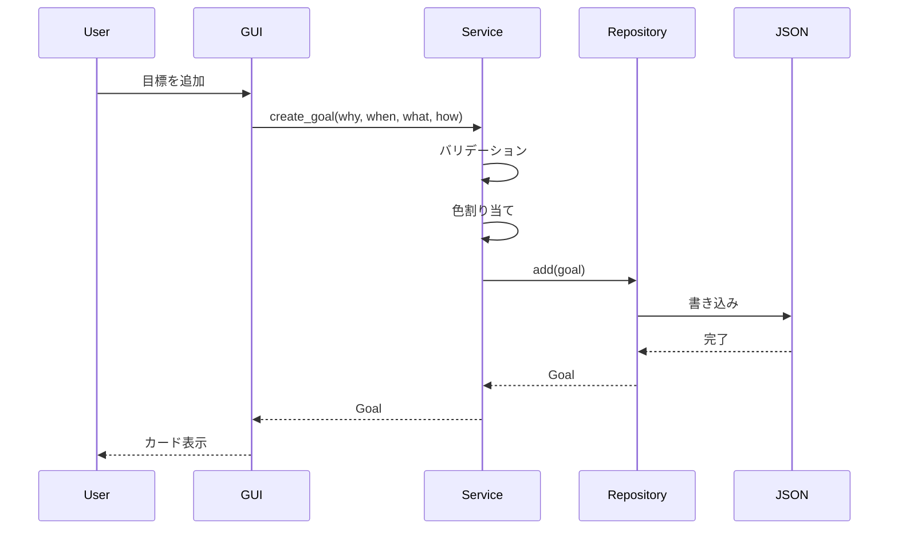

# システムアーキテクチャ設計書

更新日: 2026-02-25

## 概要

Study Qualification Applicationは、社会人の自己学習者向けPySide6 GUIアプリケーションである。
複数の学習目標を3W1H（Why・When・What・How）で登録し、ガントチャートで進捗を視覚的に管理する。

## ペルソナ

**田中太郎（32歳・ITエンジニア）**: 仕事をしながらAWS資格とTOEICの勉強を並行。帰宅後の限られた時間で計画的に学習したい。「なぜやるのか」を見返してモチベーションを維持し、ガントチャートで進捗を把握したい。

## レイヤードアーキテクチャ

```
┌─────────────────────────────────────────┐
│           GUI Layer (View)              │
│  - PySide6ウィジェット                  │
│  - イベントハンドラ                      │
│  - 表示更新                              │
└──────────────────┬──────────────────────┘
                   │ 呼び出し
┌──────────────────▼──────────────────────┐
│         Service Layer (Logic)            │
│  - ビジネスロジック                      │
│  - バリデーション                        │
│  - ユニットテスト対象                    │
└──────────────────┬──────────────────────┘
                   │ 呼び出し
┌──────────────────▼──────────────────────┐
│        Repository Layer (Data)           │
│  - JSON永続化                            │
│  - CRUD操作                              │
└─────────────────────────────────────────┘
```

## データモデル

### Goal（3W1H目標）

| フィールド | 型 | 説明 |
|-----------|-----|------|
| id | str (UUID) | 一意識別子 |
| why | str | 学習の動機・目的 |
| when_target | str | 目標日 or 期間文字列 |
| when_type | WhenType | "date" or "period" |
| what | str | 学習対象 |
| how | str | 学習方法 |
| created_at | str (ISO8601) | 作成日時 |
| updated_at | str (ISO8601) | 更新日時 |
| color | str (HEX) | 表示色（自動割り当て） |

### Task（ガントチャートタスク）

| フィールド | 型 | 説明 |
|-----------|-----|------|
| id | str (UUID) | 一意識別子 |
| goal_id | str (UUID) | 親Goalへの参照 |
| title | str | タスク名 |
| start_date | date | 開始日 |
| end_date | date | 終了日 |
| status | TaskStatus | "not_started" / "in_progress" / "completed" |
| progress | int (0-100) | 進捗率 |
| memo | str | メモ |
| order | int | 表示順 |
| created_at | str (ISO8601) | 作成日時 |
| updated_at | str (ISO8601) | 更新日時 |

## クラス構成

### Models

- `Goal` (dataclass): 3W1H目標データ。`to_dict()`/`from_dict()` でJSON変換。
- `Task` (dataclass): タスクデータ。バリデーション付き（progress範囲、日付順序）。
- `WhenType` (Enum): DATE / PERIOD
- `TaskStatus` (Enum): NOT_STARTED / IN_PROGRESS / COMPLETED

### Repositories

- `JsonStorage`: 汎用JSON読み書き。Pathベースでファイル操作。
- `GoalRepository`: Goal CRUD。JsonStorageを利用。
- `TaskRepository`: Task CRUD。goal_idでフィルタ可能。

### Services

- `GoalService`: Goal作成（バリデーション、色自動割り当て）、更新、削除（タスク連鎖削除）。
- `TaskService`: Task CRUD、ステータス自動管理（進捗率に連動）。
- `GanttCalculator`: 日付→ピクセル変換、タイムライン範囲計算、バー座標計算。

### GUI

- `MainWindow`: QMainWindow。サイドバー + QStackedWidget。
- `Sidebar`: アイコン付きナビゲーション。テーマ切替ボタン。
- `GoalPage`: 目標カード一覧。追加/編集/削除。
- `GoalCard`: 目標情報をカード形式で表示。
- `GanttPage`: 目標選択コンボ + ガントチャート。
- `GanttChart`: QGraphicsView/Scene。バー描画、今日線、月ヘッダー。
- `GanttBarItem`: QGraphicsRectItem。計画バー + 進捗オーバーレイ。
- `GoalDialog`: 目標登録/編集フォーム。
- `TaskDialog`: タスク登録/編集フォーム。
- `ThemeManager`: ダーク/ライト切替。QSS生成。設定永続化。

## ガントチャート描画方式

`QGraphicsView` + `QGraphicsScene` を使用:

- **ヘッダー**: 月の目盛りを上部に描画
- **グリッド**: 縦線で月境界を表示
- **バー**: 各タスクをQGraphicsRectItemで描画
  - 計画バー（半透明）の上に実績バー（進捗%分の幅）を重ねる
  - 目標の色で統一表示
- **今日線**: 赤い破線で現在日を表示
- **ツールチップ**: バーホバーでタスク詳細を表示

### 座標計算（GanttCalculator）

- `pixels_per_day = 30`: 1日あたりのピクセル数
- `row_height = 40`: 1行の高さ
- `header_height = 50`: ヘッダー高さ
- `bar_height = 24`: バーの高さ
- `bar_margin = 8`: バーの上下マージン

## テーマシステム

QSSテンプレートに色パレットを展開する方式。

### カラーパレット

**ダークテーマ（Catppuccin Mocha）:**
- 背景: #1E1E2E
- テキスト: #CDD6F4
- アクセント: #89B4FA

**ライトテーマ（Catppuccin Latte）:**
- 背景: #EFF1F5
- テキスト: #4C4F69
- アクセント: #1E66F5

### テーマ永続化

`data/settings.json` に `{"theme": "dark"}` 形式で保存。

## データフロー



## 将来の拡張

サイドバーナビゲーション構造により、以下の機能を容易に追加可能:

- 学習記録ページ（日々の学習時間記録）
- 統計ダッシュボード（学習時間の推移、目標達成率）
- カレンダービュー
- エクスポート/インポート機能
- 通知・リマインダー
